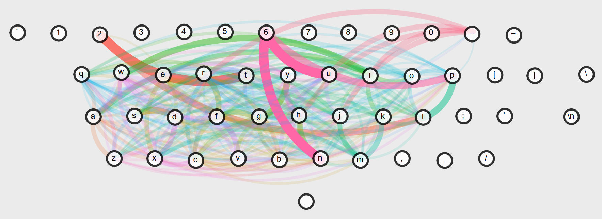

# getwitter
Real world twitter investigation.

## Introductie

Op een dag kwam ik langs dit twitter account en raakte ik geinspireerd door het idee van deze beste man. "Latvian creative director Voldemars Dudums", een kunstenaar uit Latvia dus, een plaats onder Finland. Hij plaatste wat varkensvet op een toetsenbord om de vogels een stem te geven, en zo geschiede. Het [twitter account](Twitter hungry birds) in de browser op de pc waar het vakens toetsenbord aan hing ging viral.

## Data
Twee weken aan koolmees dansen heb ik van twitter geplukt en daar ben ik mee aan de slag gegaan. Een eerste indruk kan ik snel verkrijgen dankzij deze [tool](https://www.patrick-wied.at/projects/heatmap-keyboard/ "Zelfs lange dunne vingers ondersteuning!"):

Voor smalle vingers...

Voor dikke vingers... :)

## Toetsenbord plotten
Om de data goed te kunnen plotten moet ik een toetsenbord in mijn grafiek zien te krijgen. Dit doe ik door een afbeelding van een toetsenbord in Matlab weer te geven en een programma te schrijven waarmee ik de coordinaten van de toetsen kan aanklikken en opslaan, zie [het Matlab script hier](src/mark_coordinates.m).
Dit resulteerd in de volgende toetsen (en karakters die je krijgt met Shift ingehouden... kost dus iig 2 vogeltjes). Te toets die de uitvoerder moet aanklikken verschijnt simpelweg in de std out en na het aanklikken worden de coordinaten opgeslagen en hier zie je het resultaat:

## Op naar R

Deze coordinaten zijn gemakkelijk om te zetten in een CSV bestand. Ook maak ik een CSV bestand om de relatie tussen de index van het karakter en het karakter zelf vast te leggen. Dit mag in Matlab dan heel evident zijn, maar in R is dit minder gebonden aan elkaar.

Eerst even alle sprongetjes in beeld brengen. Als alle lijnen die, bijvoorbeeld, vanaf de 'e' toets vertrekken, of daarnaar toe gaan precies op die coordinaat vertrekken en aankomen, dan krijg je geen heat map effect. Daarvoor is er in het [R script](src/main.R) een jitter toegevoegd. Na wat brommen komt de volgende afbeelding langzaam tevoorschijn.

Niet veel zeggend, dus laat ik de lijnen wat transparantie meegeven en hopen dat ik zo een soort heat map kan krijgen.

Leuk! Maar eeh, hoeveel vogeltjes springen er vanaf de toetsen '`', '1', '2' naar elders vraagt u zich af?

Hmmm... Ow, en we kunnen ook ontdekken wanneer er twee vogeltjes actief zijn! Want wat gebeurt er elders op het toetsenbord als er één vogeltje met zijn achterste op de shift toets gaat zitten? Dit zien we dan...

De 'van' en 'naar' sprongen zijn hier gecombineerd, en de kleuren zijn feitelijk oplopend op basis van het alphabet, maar dat is dus aardig random op een toetsenbord. Het lijkt alsof we het vogeltje zien wegschrikken van 'p', 'u', 'n' en 'l' door een vogeltje die rechts op de shift springt.

We kunnen ook zien dat er minder vogels korte afstanden springen dan langere afstanden, of we hebben ook dan weer te maken met meerdere vogeltjes. Zie hoe de 'e' -> ']' vele malen populairder is dan de 'e' -> '7' sprong!

## Conclusie
Er is werkelijk niet veel uitsluitsel te geven over het gedrag van de beesies. Denk aan de maximale hoeveelheid tekens voor een Twitter bericht, pas bij een 'enter' kunnen nieuwe karakters geplaatst worden. Verder zijn hoofdletters zowel door CapsLock als door de Shift toets mogelijk en word een karakter vele malen neergezet wanneer de toets wordt ingehouden. Ook kan er veel tijd zitten tussen de verschillende inputs en is het dus niet te achterhalen of het 1 of meerdere vogels zijn die het toetsenbord bedienen.

Al bij al is het een leuk onderzoekje geweest en was het vermakelijk om te proberen hier mooie visualisaties van te maken. Zover mijn hobby project.

[Twitter hungry birds]: https://twitter.com/hungry_birds?ref_src=twsrc%5Etfw%7Ctwcamp%5Etweetembed%7Ctwterm%5E181042370471657472%7Ctwgr%5E%7Ctwcon%5Es1_&ref_url=https%3A%2F%2Flaughingsquid.com%2Freal-birds-send-messages-on-twitter-by-feeding-on-pieces-of-pork-fat-that-are-attached-to-a-keyboard%2F